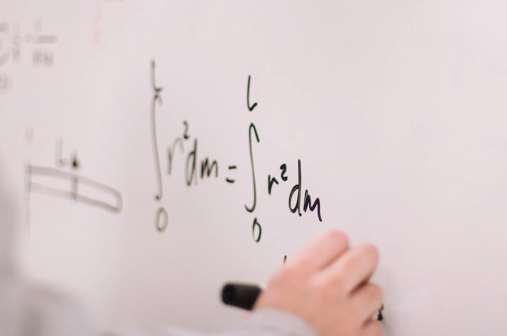

import Abbreviation from "@/components/typography/Abbreviation.astro";
import Underline from "@/components/typography/Underline.astro";

We've all been there, right? We went through something stressful &ndash; doesn't matter exactly _what_ it was, but once thing is certain: _It wasn't fun_, even more so if that _something_ was due to **work-related stuff**, you know, where most of your day-to-day life stress might come from.

Perhaps you just went through a tight sprint, or you almost missed a deadline, or even more, your team just **released** months worth of work and it's now out to the test of public and usage &ndash; sounds a bit specific, doesn't it? Well, you'd be right, because that's _exactly_ what **happened to me** over the past couple of months.

At my job, my team and I finally launched the MVP of a project that had been in development (at the time of writing this) at least **3 years or so**, with lots of planning, anticipation, preparation, it actually went _very_ smooth, **way more** than we expected.

The ceremony was followed up with huge props from management, stakeholders, and the entire company, we **finally** hit that lifelong milestone we had all been waiting for, but... For some reason, I **still** felt _stressed_.

If you've ever been on a similar situation on your day-to-day job, let me tell you why it feels **the way it does**.

## The accumulation

But, wait, wasn't everything _supposed_ to feel good as soon as the stress factor went away? Not quite, as stress doesn't grow **linearly**, nor does **calmness** when exiting out of a stressful period (like the months prior to a big project launch).

Emotions _build up_ over time, they _do not_ appear out of nowhere, just like they won't suddenly go away. It's a **curved slope** that our minds and bodies have to overcome when **transitioning states**.

Knowing this is the key to identifying _why_ we're feeling the way we do. "How long have I been **actually** feeling this way?", "Is this new for me?", "What factors cause this type of pressure?", perhaps you **already know the answer**. Maybe you spent way more than your average 8-hours, maybe you did work stuff on weekends, or simply agreed to be on-call on one of your days off.

Those are _very_ common things we, as programmers, tend to do, while also **underestimating** the effect such things can have on our overall state of mind at work, even more, the **accumulation** of these things happening over, and over again.

Some times we can't help it, right? It's most often our duty to do our **absolute best** to keep a project alive and moving forwards, other times we simply **don't have a choice**, given the project nature it can perfectly be the **right thing to do**, and we need to be mentally _and_ emotionally prepared for such situations &ndash; to not let them **accumulate**.

Think about this, **bombs** are dangerous not because of how much energy they release, but how **quickly** they do so, causing irreversible damage from one second to the other. We, as humans, are flexible, but even the most flexible things out there struggle to come back to its original shape after they **decompress**.

Stress is a **silent** evil &ndash; you only notice it once it's grown past your sight, and we have to be very careful on how we handle it. Let's see how we can't prevent it from doing so.

## Regain control over your life

First step in being able to control & wear out stress from your life, is to **successfully** control yourself first &ndash; this is, being able to stay in control over what happens in your life, how your day-to-day looks, how you feel and how you handle any incoming situation.

Let's talk about one of the most common topics that comes up when thinking about life balance, **habits**.

> In times of life crisis, whether wildfires or smoldering stress, the first thing I do is go <Underline>back to basics</Underline>. am I eating right, am I getting enough sleep, am I getting some physical and mental exercise every day?

Habits are a great way of regaining control over your life, and getting you on the right mindset about how to organize yourself in order to have a relaxed day, wether or not how work goes that day. Now, ask yourself a question, "what is it that I look forward on a regular day?".

It doesn't need to be anything extraordinary, or crazy. Sometimes, life's greatest things can be found on the small and simple. To me, I really love doing the following:

- Waking up **early**, and working out.
- Having a **shower**.
- Making **tea**, or **coffee**.
- Taking some minutes to **read**, at least just a bit.

It's nothing out of the ordinary, yet it **helps** on making me feel productive through small achievements during the day that, just like stress and heavy emotions, **accumulate** and build up to an overall sensation of _success_ and _gratitude_, which is great at counteracting stress.

Pick a few things that you'd like to have on your day, and give them the **space** to actually be a **part of it**. You'd be surprised how _easy_ it becomes detaching from work once it's time to do one of those things, which leads me to the next point.

## Learn when to detach

It's **very** important to know when too much _is_ too much. We all have different limits, but one thing is certain, we **shouldn't** let our work thoughts and worries slip into our personal lives to the point where there's no clear distinction between them.

There's no easy way to call it quits on that one thing stressing us that we **really** want to get done before tomorrow's daily standup. We don't want to push back deadlines, or show less commitment, but here's where we have to be firm over our thoughts, and **know** that respecting limits is **not** being a worse employee.

What is more valuable to a company? A developer that finished 10 tasks in **one day**, but got incredibly **tangled up** for the rest of the week without being able to push anything else? Or a developer that delivers consistently during entire months and communicates well over complexity and expectations?

**Quantity** without **consistency** is effectively <Underline>worthless</Underline>, but... Do we **really know** how to detach without affecting our work?

## Divide and conquer

Picture this: it's 5:00 PM, you're **about** to finish _that one task_ that you've been working on all day long. It's time to go home, but you just **can't** leave that task unresolved, you're tempted by the idea of staying until it's solved, but you get a _déjà vu_ &ndash; **this has happened before**, and what seemed like minutes worth of work, ended up being 3 hours or **more**. What do you do?

You might just have given yourself the answer. You're determined to get this done in a **few minutes**, but you _also_ know 9 out of 10 times, it's **not** just a few minutes. What's the right move on this situation?

"If it's critical, then it must be done", you might think, and you'd be **absolutely right**, but you also have to ask yourself this: How often is it **actually** critical? If the answer points to it being pretty often, then, as my <Abbreviation title="Project Manager">PM</Abbreviation> once said:

> If everything is critical, then nothing actually is.

The "criticality" of the thing is actually very simple: You don't want to leave things for tomorrow, and that's a **good** thing, but it can also **backfire** pretty quickly, by blurring the line of when is it actually a good idea to stop, and pick up where you left off the next day.

Why is this a good idea? It helps you on becoming more **consistent** on delivering, as you not only set the right expectations about the amount of work you can get done on a given amount of time, but you _also_ give yourself time to rest, and come back with a fresh mind, and **way more** energy.

Perhaps finishing that task the previous day would've taken **3 hours** to complete, but since you gave yourself the time to rest, and start again the next day, you were able to ace it and getting the work done in just **one hour** &ndash; see? Not only did you finished up **way faster** (in terms of work hours), but you also managed to do it **without** sacrificing after-hours time, and proper **rest**.

## Where do we go from here?

Getting to this level of balance is not a thing that happens overnight &ndash; it takes **time**, a **lot** of time. It's a dilemma that can span over the **entire career** of a human being, but it's not about getting it from **one day to another**, but rather doing _small bits_ of progress every day. This goes to myself as well, as I **still** struggle with this pretty often.

Knowing how to keep you motivated, and detached from everyday stress at work can be a game changer, and the **key** to living a **happy** and **healthy** lifelong career, and it might also be useful to not **burn yourself** out only 3 years in (which happened to me).

If you're struggling with this, and also find a hard time seeing a way out of it, just remember that _everything is a process_. Don't go too hard on blaming yourself for not being able to properly maintain a **balance** on your life, instead, focus on **finding small ways** to **switch gears**, one day at a time. Calm will **always** come after the storm.

Breathe in, breathe out. Everything's gonna be fine.
