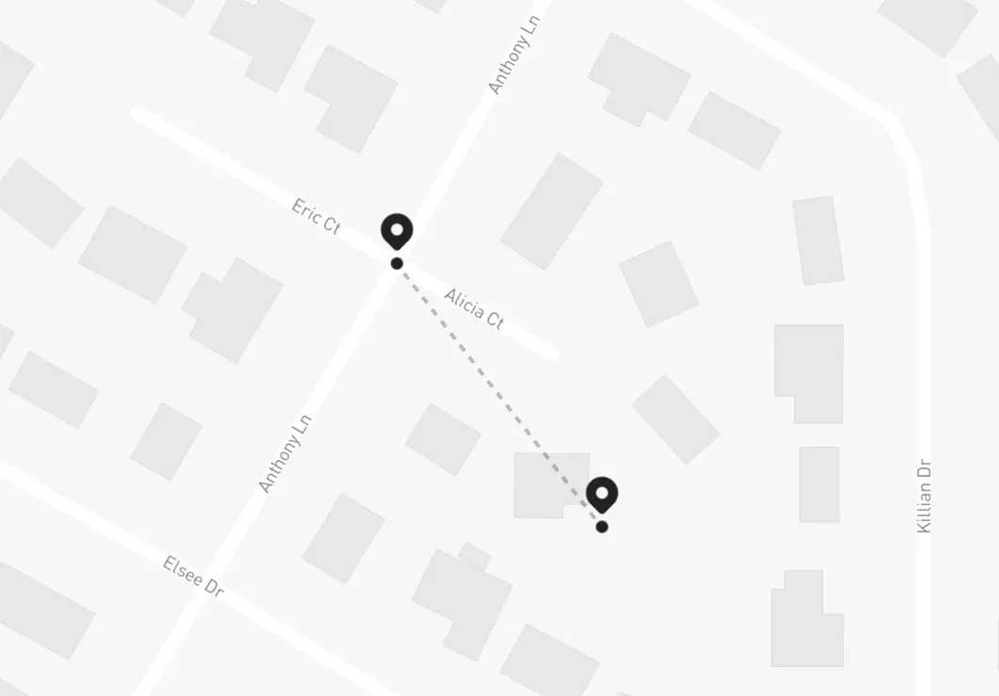
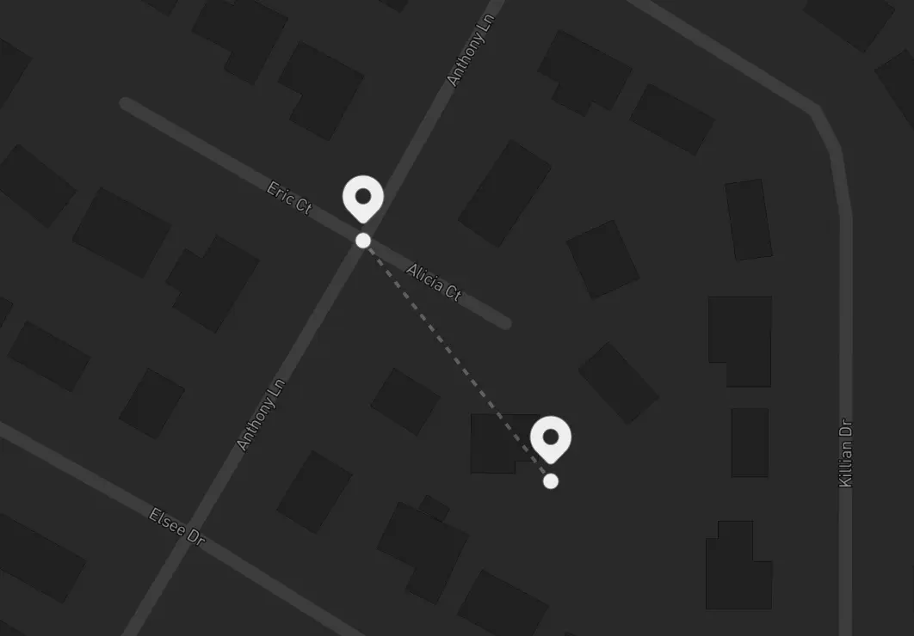
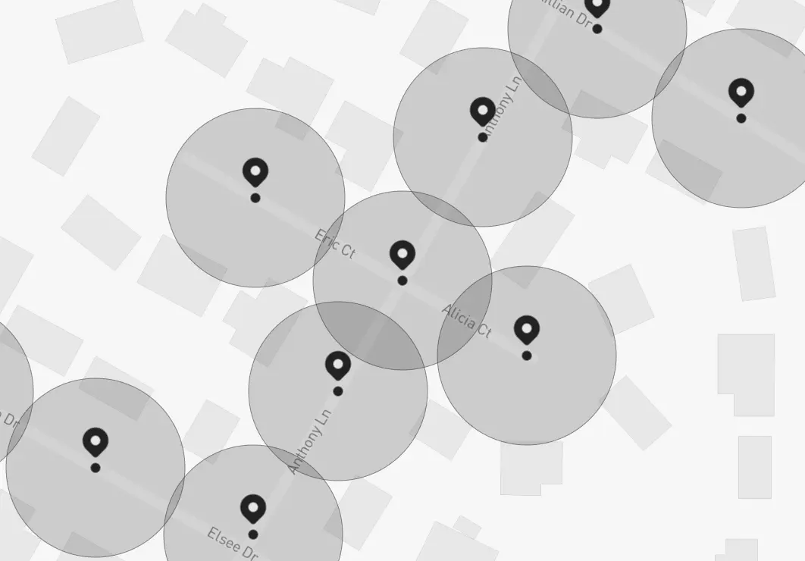
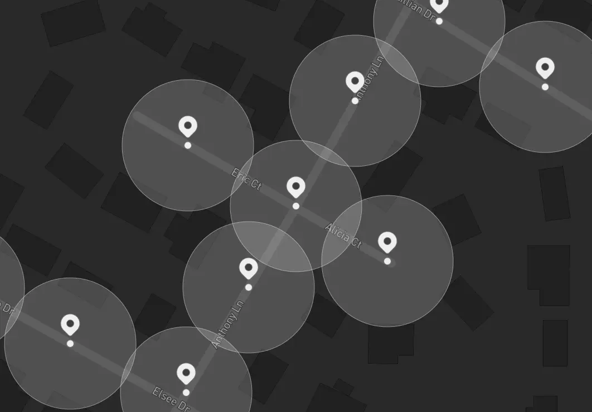

import Abbreviation from "@/components/typography/Abbreviation.astro";
import Underline from "@/components/typography/Underline.astro";

import Figure from "@/components/structure/Figure.astro";
import Paragraph from "@/components/structure/Paragraph.astro";

import Link from "@/components/navigation/Link.astro";

import Component from "@/content/blog/components/Component";
import ActivityFeed from "@/content/blog/components/ActivityFeed/ActivityFeed";
import WalkingMeter from "@/content/blog/components/WalkingMeter/WalkingMeter";
import SavingsChart from "@/content/blog/components/SavingsChart/SavingsChart";

import Meme from "@/components/extras/Meme.astro";

import Billing from "./assets/005/billing.webp";

APIs are great, especially if they're from a third party that has already solved a complex problem that we might be facing at some point &ndash; who doesn't love a good old `npm install @{company_name}/sdk`? Just a few steps and you're up and running, it feels pretty much like magic.

There's no need to reinvent the wheel... [Right](https://dayssincelastjavascriptframework.com/)?


But, as wonderful as they can be, they're also one of the easiest ways of shooting yourself in the foot &ndash; nothing is free, and everything comes at a cost, this is why, out of _many_ alternatives & services out there in the market, there's a non-trivial decision-making process behind most (if not all) API choices.

As someone _very wise_ once said:

> With great power, comes great responsibility.

Which holds true in the case of <Underline>leveraging paid third party services</Underline>.

Imagine you're a startup founder &ndash; you have this app which you're trying to build, hoping it's the next breakthrough into a specific market, _but_ you're still <Underline>not making any money off of it</Underline>, hopefully investing just the necessary to get your <Abbreviation title={"Minimum Viable Product"}>MVP</Abbreviation> up and running. It's in your best interest to ensure your service bills don't skyrocket in a way that makes it impossible to even finish a product that still isn't <Underline>profitable</Underline>.

If you're not careful with the services you're using, they will backfire. This, as _obvious_ as it might sound, happens more often than you'd think and, in fact, it happened to me as well &ndash;or, to be clear, a project where I used to work a few years ago&ndash; when one of our services billed us way more than we anticipated, and we had to do something about it.

This is the story of how we tamed [Google Cloud Platform](https://cloud.google.com/) and significantly reduced service usage costs by thinking, testing, iterating and using the power of, guess what? Math.

Let's get technical.

> Note that, for obvious privacy reasons, the story details will be kept as generic as possible in order to avoid revealing any critical/private company information.

## The app

First, some context &ndash; you (and by _"you"_ I mean _"me"_, at about 2 years of experience) are working on a multi-database <Abbreviation title={"Software as a Service"}>SaaS</Abbreviation> application, targeted towards companies that handles vehicles & drivers, productivity is measured based off of driver activity, meaning, the app has to collect driver metrics (think <Underline>GPS location</Underline>, <Underline>driving speed</Underline>, <Underline>idle time</Underline>, etc).


The service was fully equipped with a web application made in [React](https://react.dev/) (targeted towards management), a server written in [Node.js](https://nodejs.org), and a mobile app written in, you guessed it, [React Native](https://reactnative.dev/) (targeted towards drivers & other employees). The mobile app was the source of all employee activity, so there was a _special_ focus on it, making sure it works as expected and was tracking properly at all time, sending location data that the server would then save as <Underline>coordinates</Underline> in a table (along with a timestamp and some other information).

In contrast, the UI-part of the system was only used by managers & HR employees, collecting & displaying all of the critical company data, which in of itself was _a lot_ &ndash; there were performance metrics everywhere: leaderboards, charts, MTD & YTD company productivity measurements, driver activity summary & much more. One could imagine how such system relies on <Underline>data aggregation gymnastics</Underline> in the backend &ndash; most of the _"magic"_ happened there and, even though the website had considerably less traffic, the processing needed in order to simply serve the dashboard data was huge.

One thing was certain &ndash; this app was way more legacy than I imagined, as the backstory goes, development started of many years before I even joined the company I worked for at that time, so most of the system behavior &ndash;although brittle & fragile&ndash; was _already built_. Keep this in mind, as it will come into effect once we talk about the problems that arose, quite literally, days after I joined.

_One of which I still remember to this day._

## Alarms go off

One day, at our daily standup (which happened pretty early in the morning for me), it was immediately brought to discussion a _critical_ situation &ndash; a Google invoice had arrived with the monthly bill, and it was nuts, our bill had almost 10x'ed compared to last month's, surpassing the thousands of dollars. As you might imagine, the CEO was going crazy &ndash; understandably.

Past invoices were nowhere near that price we received, clearly something wasn't right, so we immediately started investigating.

<Figure src={Billing}>
  Imagine waking up to find out your monthly bill suddenly skyrocketed... [Oh,
  wait](https://serverlesshorrors.com/).
</Figure>

After carefully looking at the Google Cloud dashboard, we immediately found the major source of usage &ndash; the [Geocoding API](https://developers.google.com/maps/documentation/geolocation/overview). We knew that, although we had various maps on the site, there were only a few places where we were using that part of the SDK, so that was our starting point.

However, let's go back to the dashboard for a moment &ndash; there's a special page which &ndash;in the CEO's own words&ndash; was _"specifically designed for management to keep open all day"_, as it contained _"real-time"_ updates from the ongoing shifts (you'll see why I'm quoting it <Underline>pretty soon</Underline>) and, most importantly, contained a _very specific_ widget &ndash; the Activity feed, which looked something like this:

<Component>
  <ActivityFeed />
</Component>

Pretty simple, right? Just a list of the most recent system alerts, which were very important for management, as it was one of the main selling points of the app &ndash; a straight eye into what's going on company-wide during the current shifts. The point of the widget is to receive <Underline>updates & events</Underline> from the server, and immediately reflect those updates in the client, such that a manager wouldn't have to exit or refresh the page to continuously monitor how the drivers were doing. So far so good, _however_... There's a catch.

You might've noticed the feed has pagination controls &ndash; pagination is great, as its purpose &ndash;more than just organizing data visually&ndash; is to help alleviate load times by only requesting the data for the current page you're in, and load everything else as the user moves between pages. That's how basic pagination should be implemented, right?

_...right?_ <Meme name="padme" />

Turns out, it wasn't the case. The request at load-time would bring all data altogether, rendering the pagination completely useless (making it merely a visual thing), _but it doesn't end there_ &ndash; remember I purposefully quoted the so-called _"real-time"_ part? One would assume that, after the UI loads (along with the entire list entries), newer events would just slot a new entry into state, since past events have already been loaded.

Wrong, again. As soon as a new event came in, the app would blow out the entire list and fetch everything all over again, meaning, if we had 100 events, and a new one came in, the list would be re-fetched and get 101 events back.

_What?_

Alright, alright, let's step back for a moment, we have a _very bad_ UI implementation and, arguably, a really poor update strategy, but how is this related to the billing problem? Here's the thing &ndash; take a look again at the Activity feed, what information does each location have?

Let's see, it has a name, a type, an address... Hold on, an _address_? Didn't you just say this in the previous section?

> "...sending location data that the server would then save as <Underline>coordinates</Underline> in a table..."

How did an address end up there if the mobile app sends only coordinates? Well, remember I mentioned something about the Geocoding API?

I think you already see where this is going.

That's right, the database has only coordinates but the app needs addresses, and GCP's Geocoding suite _just so happens_ to have a service called Reverse Geocoding API, which the [documentation](https://developers.google.com/maps/documentation/javascript/geocoding#ReverseGeocoding) describes as the following:

> The term geocoding generally refers to translating a human-readable address into a location on a map. The process of doing the converse, translating a location on the map into a human-readable address, is known as <Underline>reverse geocoding</Underline>.
>
> Instead of supplying a textual `address`, supply a comma-separated latitude/longitude pair in the `location` parameter.

The app was using the Reverse Geocoding API to convert each of the alert's attached coordinates into addresses, and remember, each time we open up the dashboard the app loads all alerts at the same time! Which means, going back to the 100 alerts example, the act of a person simply navigating into the page would then trigger <Underline>100 API calls</Underline> and, if a new notification came in 5 seconds later (considering we're re-requesting the entire list again), those would be <Underline>101 calls</Underline> _apart_ from the past 100, giving us a total of <Underline>201 API calls</Underline> in a span of just 5 seconds &ndash; wasn't this page supposed to be _"safely kept open"_ during the entire 8 hours of the shift?

Clearly, this is bad, and things get way darker once you realize the full extent of the problem &ndash; we weren't even at 10% of the intended usage! Just by how the system was built (considering that each client would have their own separate database) we were able to run some numbers to try and predict how the billing would scale as the user base grows, and let me tell you, _it's way worse than you could imagine_.

Just to give you an idea, here's a _very_ high-level approximation of these numbers I came up with at the time:

$$
R = C * M * \sum_{n = 0}^{t * a} n
$$

I know &ndash; _what the hell?_ Breaking down the equation we have:

- $R$ as the <Underline>total amount of requests</Underline> made in a day.
- $C$ as the <Underline>number of companies actively using the system</Underline>, by that time, it was just us (assume 1).
- $M$ as the <Underline>amount of managers</Underline> that would be signed into the app monitoring the feed (our CEO was the only one constantly checking the page, assume 1 again).
- $t$ as the <Underline>total hours spent</Underline> watching the dashboard per day, he would spend about 4 hours at most.
- $a$ as the <Underline>average alerts per hour</Underline> (usually 45 or so).
- $n$ (which is within a sum from 0 up to $t * a$) is the <Underline>number of Reverse Geocoding requests</Underline> accumulated as the alerts come in, which is the calculation we ran before: a manager starts their shift with 0 alerts, then 1, then 2, then 3, and so on.

Plugging those numbers into the equation yields about 16,290 requests per day, convert that to a monthly basis (about 20 working days) and it's 325,800 requests per month &ndash; Google charges about \$0,004 per API call, so that gives a grand total of \$1,303.2 for usage, which is roughly around what we were being charged with, and remember &ndash; it was just us! If we assumed a more broad user base of 4 companies, with 3 managers each and full 8-hour monitoring, we'd be charged approximately \$31,190.4 (if we didn't have to contact sales already for [volume pricing](https://developers.google.com/maps/documentation/geocoding/usage-and-billing)), which is just ridiculous.

With no time to waste, we started brainstorming right away.

## Initial thoughts

Alright, we had to come up with something, what are our options? The first solution that came to mind was the most obvious &ndash; fix the pagination and the notification system. There's no discussion, this was a _must_, and looking into other options without considering this would've been pure negligence, however, there were some _slight_ problems:

- The frontend guy gave a very broad estimate, he said he needed to _"rewire"_ that component's inner workings, and he would have to spend some time syncing up with the backend dev to refactor the endpoint in order to support paginated requests (I know, you're probably screaming at this &ndash; I was too).
- The notification system worked through [web sockets](https://developer.mozilla.org/en-US/docs/Web/API/WebSockets_API), and this implementation was soon to be deprecated, as the backend would transition from an [EC2 instance](https://aws.amazon.com/ec2/) to an auto-scalable [EBS configuration](https://aws.amazon.com/elasticbeanstalk/), which in turn made us look into another push notification alternatives and not assume that the current state of notifications would stay around much longer.
- There were some future features that would work very similarly to this activity feed, but those wouldn't have pagination &ndash; there were more data-heavy UI parts coming soon, and we had to be prepared for that.

This, although didn't necessarily block the so-needed refactor, it definitely made us know that we needed to look for additional short-term measures that helped us at least alleviate the billing, while also thinking forward on how to create a consistent, budget-friendly way of handling locations.


Our CEO mentioned something that at first _kinda_ made sense as well &ndash; can't we pull the address along with the coordinates from the device's GPS itself? We _thought_ there may be a chance, but that was quickly shot down, as we found out the only way is to, guess what, call the Geocoding API from the device, and this would be even worse, as the app reports locations every 5 seconds, for an 8-hour shift that would be 5760 requests per shift, but remember, there's way more drivers active on the road than managers checking the activity feed! About 10-15 were active by that time, if each one of them produces ~5k requests per day... I won't even try to run those numbers.

That same day, after more brainstorming with my tech-lead at that time, some light was shed on our idea pool &ndash; a <Underline>location cache table</Underline>. The idea was simple: what if we could store addresses and their corresponding coordinate pairs into a table that we'd lookup whenever we needed? Database reads & writes are _way_ cheaper than Geocoding API calls, and considering we had plans to overhaul & fix the frontend's inefficiencies, it _seemed_ plausible to simply create a dictionary that we could fill over time and then query just like we would with the Geocoding API.

Alright! Let's get to wor&ndash; wait... Have you seen what coordinates look like?

```json
{
  "lat": 28.497497,
  "lng": -81.275426
}
```

You _might_ already see what the problem is &ndash; How on earth would one simply query for a pair of numbers like that? Coordinates require <Underline>floating-point precision</Underline>, and GPS data is extremely granular, even if you stored all of the coordinates a driver sends during a shift, the odds of hitting the exact same pair again are extremely low. If we were to translate all of those coordinates, we would end up with almost the same usage as if we called the Geocoding API with every GPS ping.

_"Let's just <Underline>trim some decimals</Underline> then"_, my tech-lead said, but that wasn't an option either &ndash; for an app like this, decimal precision was an invaluable asset, as it was the key to the movement insights used to measure performance and, therefore, derive bonuses & other payroll metrics; the system needed to not only measure driving speeds, but also walking pace as well. Even if we removed <Underline>3 decimal places</Underline>, we would still be in a place of highly unlikeness to have a record that matched our queries, and we'd be messing up the detection &ndash; let me illustrate.

Let's take above's coordinates as an example, those locate to this place in particular:


What would happen if one of the employees were walking around that area, and the app wanted to process their location _but_ trimming the last 3 decimals? This is approximately what it would look like:




See the problem? Suddenly the person is 100 meters away from their true location,
and the speed detection service would start miscalculating everything &ndash; if it took <Underline>3 decimal places</Underline> to make a <Underline>100 meter difference</Underline>, in the eyes
of the speed measurements the person would remain still (this is, 0 m/s) for
about 2 minutes before &ndash;seemingly out of nowhere&ndash; spawning 100
meters apart from their last position, making it _look like_ they moved at
100 m/s before going back to being still again:

<Component>
  <WalkingMeter />
</Component>

We haven't invented teleportation yet.

Regardless, I still liked the idea of the lookup table &ndash; it would be really, really convenient to have a centralized place that collected the addresses just once and we could use it everywhere and avoid hitting the Geocoding API more than the necessary, but we have this inevitable wall when trying to intuitively use whatever information was stored there due to the problem of querying with <Underline>no exact matches</Underline>...

_"...Exact matches..."_ &ndash; wait.

I had an idea.

## Geometry to the rescue

My mind was speeding at 1000mph, blood pumping through my veins like engine oil, thoughts insanely revolving this _idea_ that hit my head like a bullet train &ndash; everything was clear now.

_It doesn't «have» to be <Underline>exact</Underline>_.


What if we could _"fuzz-out"_ the search and _expand it_ to get the nearest stored point to our location? That way, we would have way more chances of finding a match, and we would have <Underline> total control</Underline> over how close we want those points to be, just so we can predictably assume an error tolerance that worked for us without compromising accuracy over the <Underline>speed calculations</Underline>.

We could then safely follow the cache table workflow, which would go something like this:

1. Receive a `location`, search it inside `stored_locations`.
2. If we _don't_ get a match, call the Reverse Geocoding API and store both the `location` and the `address`, return that result.
3. If we _do_ get a match, just return it.

_Sit tight, I'm going full Wikipedia now._

We now just need a way to measure distance between two coordinate pairs on a spherical surface as our filter function which, fortunately, we already have &ndash; the [Great-circle distance](https://en.wikipedia.org/wiki/Great-circle_distance):

$$
\Delta \sigma = \arccos \left( \sin \phi_1 \sin \phi_2 + \cos \phi_1 \cos \phi_2 \cos \Delta \lambda \right)
$$

Where $\lambda_1, \phi_1$ and $\lambda_2, \phi_2$ are the longitudes & latitudes of each point in _radians_, accordingly, and $\Delta \lambda, \Delta \phi$ their absolute distance, what this produces is the $\Delta \sigma$ term: the central angle between those points, which we can then use to calculate the distance $d$ trivially through:

$$
d = r \Delta \sigma
$$

Where $r$ is the radius of the sphere (in our case, the Earth, sitting at around 6,371 km). What this would end up doing is basically creating a sort of <Underline>boundary map</Underline> of known regions within our database, which would self-feed and increase accuracy while decreasing API usage very quickly over time. If we take the street from the previous example, after a simple navigation, the map would be filled with regions like this:




And the best part? It's just a query change! This filter can be shoved inside our data-access layer by adding the third term `distance` as the equation result to our query, paired with a `HAVING` clause that sets a clear threshold for the search radius we're going after &ndash; this would end up looking something like this:

```sql
SELECT latitude,
       longitude,
       ACOS(SIN(latitude) * SIN(:lat) + COS(latitude) * COS(:lat) * COS(ABS(longitude - :lng))) * 6378160 AS distance -- [!code highlight]
FROM stored_locations
HAVING distance < :distance
ORDER BY distance;
```

We found 25 meters to be the sweet spot for setting a threshold radius trough `:distance`, and we could also throw in a `LIMIT 1` since we only care about the closest match and, worst case scenario, we would only be 25 meters off from the address calculation (not the speed or geographical position, like with the <Underline>decimal trimming approach</Underline>). That's it!

I quickly drafted a PR, got it through all they way up to the staging environment, immediately started testing with the ongoing shifts, and waited patiently &ndash; this was the initial cold run, the database was <Underline>completely empty</Underline>, but right away started filling up with locations and their corresponding addresses from all the current drivers, so I was expecting some sort of high usage for that day. To better evaluate the performance, I created a log stream that would keep track of <Underline>database & API hits</Underline> by day, just so I could measure the progress afterwards.

Needless to say, I went all-in on this approach &ndash; I had run all the calculations in my head, it _should_ work but, still, I was pretty nervous.

After that _really_ painful night, next day came in...

No amount of overthinking prepared me for what I'd find &ndash; we were already down to about 65% of <Underline>past day's usage</Underline>. This was huge, and the best part is, it would only keep decreasing:

- Most drivers had recurrent routes as each one had a designated area, sites they'd go over by routine.
- They would also had a set of company-wide common places to drive by.
- The company's scope was limited to only their city & small amounts of surrounding places, there would be no randomly driving to the other side of the state.

And these facts hold true for the companies that this system targets as well. Two weeks later, we were at just below 15% of the usage, and it kept consistently decreasing even more and more &ndash; by the end of the month, we were charged with only $183 or so, meaning, we had successfully saved ~86% of past month's bill:

<SavingsChart client:load />

> Note that these graphs are just an approximation to the call history from back then, as I don't have access to that project and/or its resources anymore.

This trend continued and settled at around 10% of that _awful_ bill's pricing for the next month's usage, effectively saving the company 90% in Google's API cost. It's worth mentioning that the bill _will still increase_ as new companies join the system & start tracking drivers, but in a very reduced fashion thanks of to improvements in that page, as the component was eventually fixed, completely <Underline>detaching</Underline> the API usage from that page's activity. Hooray! 🎉

Management was happy, the CEO was grateful, and we continued pushing performance further and further around the entire application &ndash; _at least_ during the next 5 months I worked there before leaving the company.

I _could_ talk about how I took that same page's load time from two minutes to just 7 seconds, though...

_But that's another story._

## Above and beyond

Granted, the web ecosystem moves at giant steps every day that passes, and this solution &ndash;although useful at that time&ndash; _may_ not have been the best, we were very time constrained and had to act _quickly_. API refactors like this should be carefully studied and definitely planned-out ahead of time.


_Maybe_ there's a library that already does this, _perhaps_ there's another way in which we could have stored the data & queried for it that was more efficient. Knowing & using those equations wasn't any kind of _"breakthrough"_ to be honest. If anything, the only thing I _sort of_ did was figuring out how _"places near me"_ recommendations work.

Still, to this day I keep thinking about other ways we could've approached this problem differently &ndash; what if we used another service? What if there was a way to call the API even less? How can we reduce the strain of adding new companies and avoid having to let them fill-in their locations manually? As with everything in programming, the possibilities are endless, and there's no single way to solve a problem.

One thing is certain, though &ndash; had we not acted quickly and tried our best to craft a reasonable solution, this issue would've caused pretty serious damage the project. Thankfully, some equations and a _bit_ of abstract thinking were the nails in the coffin of this awful situation.

_Who said you don't need math for software engineering?_
